<h1 align="center">DBApi 快速开发平台</h1>

<div align="center">

[特性](#特性) | [在线体验](#在线体验) | [技术架构](#技术架构) | [快速开始](#快速开始) | [使用说明](#使用说明) | [运行截图](#运行截图) | [学习交流](#学习交流)

🚀 **DBApi** 是一个高效且灵活的解决方案，旨在缩短数据库与 Web API 之间的距离。通过 DBApi，开发者可以轻松地将 SQL 查询转换为 RESTful API，使数据集成与共享更加简单。

DBApi 非常适合开发者、数据工程师和希望简化数据访问、缩短开发时间并提升生产力的企业。立即使用 DBApi，充分释放数据的潜力。

</div>

---

# 👻 特性

- [x] 轻松将复杂的 SQL 查询转换为简单的 RESTful 接口。
- [x] 支持多数据源管理，满足不同场景的集成需求。
- [x] 提供接口调用日志记录功能，方便问题排查和性能监控。
- [ ] 支持多种数据库类型（MySQL / PostgreSQL / MongoDB 等，未来支持更多）。
- [ ] 内置身份验证和授权机制，保障数据安全。
- [ ] 动态生成 API 文档，快速对接开发团队。

---

# 在线体验

[在线体验](http://111.229.110.183:8088)

用户名密码：guest/guest

> 不要随意删用户及权限

# ✨ 技术架构

## 后端

- **Spring Boot**：核心框架，提供 RESTful API 支持并实现快速开发与配置。
- **MyBatis Plus**：增强型 ORM 框架，简化数据库操作。
- **Druid**：高性能数据库连接池，支持 SQL 监控与统计功能。
- **JWT**：用于用户认证和授权的安全方案。
- **Swagger**：自动生成接口文档，便于开发和测试。
- **Lombok**：通过注解生成代码，提高开发效率。
- **Hutool**：功能丰富的 Java 工具库，加速开发流程。

## 前端

[前端项目地址](https://github.com/FearlessPeople/DBApi_ui)

- **Vue 3**：基于 Composition API 的现代化前端框架。
- **Pinia**：轻量级状态管理工具，替代 Vuex。
- **Vite**：极速开发和构建工具，提升开发效率。
- **TypeScript**：类型安全，提升代码维护性。
- **Arco Design**：企业级 UI 组件库，提供优雅设计风格。
- **Axios**：用于与后端 API 通信的轻量级 HTTP 客户端。
- **Codemirror**：代码编辑器，支持高亮 SQL 和 JSON 数据。

---

# 🚀 快速开始

## 直接运行

1. **下载发布包**
   从 [Release 页面](https://github.com/FearlessPeople/DBApi/releases/) 下载最新版本的发布包的tar.gz包并解压。

2. **配置数据库**
   1. 新建数据库`CREATE DATABASE dbapi CHARACTER SET utf8mb4 COLLATE utf8mb4_unicode_ci;`
   2. 初始化数据库`init.sql`在resource目录下：`source /opt/dbapi-web-0.0.2-SNAPSHOT/init.sql;`
   3. 修改解压后的 `config/application.yml`，配置数据库连接信息。
   4. 修改解压后的 `config/application.yml`，配置redis连接信息。

3. **启动应用**
   切换到 `bin` 目录，根据操作系统运行以下命令：
    - Linux/MacOS: `sh dbapi.sh`
    - Windows: 双击运行 `dbapi.bat`

4. **访问系统**
   打开浏览器访问 [http://localhost:8088/](http://localhost:8088/) 进入登录页面。

---

## 源码运行

### 环境要求

- **JDK**：11 及以上版本
- **Spring Boot**：2.5 及以上版本
- **数据库**：MySQL / PostgreSQL / MongoDB
- **Maven**：3.6 及以上版本

### 步骤

1. **克隆项目**

   ```bash
   git clone https://github.com/yourusername/DBApi.git
   cd DBApi
    ```

2. **初始化数据库**

    创建数据库
    
    ```sql
    CREATE
    DATABASE dbapi CHARACTER SET utf8mb4 COLLATE utf8mb4_unicode_ci;
    ```

    初始化表：`init.sql`在resource目录下
    
    ```sql
    source src/main/resources/init.sql
    ```

3. **修改数据库配置**

    根据需要修改 `src/main/resources/application.yml` 文件中的数据库配置：

    ```yaml
    spring:
     datasource:
       url: jdbc:mysql://localhost:3306/dbapi
       username: root
       password: your_password
    ```

4. **运行项目**

    使用 IDE 或命令行运行 `src/main/java/com/dbapi/DBApiApplication.java` 文件启动项目。

# 📖 使用说明

1. **登录系统**  
   使用默认管理员账户登录系统（初始用户名：`admin`，密码：`admin`）。登录成功后，可根据需求修改管理员密码。

2. **配置数据源**  
   在 "数据源管理" 页面点击 "新增数据源"，填写数据库连接信息，包括数据库类型、URL、用户名和密码等。完成后点击 "测试连接" 确保连接成功。

3. **创建接口**
    - 在 "API接口" 页面点击 "新建接口" 按钮。
    - 填写接口的基本信息（如名称、路径、描述等）。
    - 在接口设计区编写 SQL 查询语句以及参数配置。
    - 保存后可以在生成的 API 列表中查看并测试新创建的接口。

4. **调用 API**  
   使用 Postman、cURL 或其他 HTTP 客户端调用生成的 RESTful API。调用时注意：
    - 请求 URL 格式：`http://<host>:<port>/api/<your_endpoint>`
    - 根据接口的设计发送 GET、POST 等方法的请求，并附加必要的参数。

5. **查看日志**  
   在 "日志管理" 页面可以查看所有 API 的调用记录，包括请求时间、调用参数、返回结果及可能的错误信息。这对排查问题和优化性能非常有用。

6. **管理用户权限**
    - 在 "用户管理" 页面添加新用户并分配角色。
    - 通过 "角色管理" 为不同角色配置权限
    

# 运行截图

登录截图
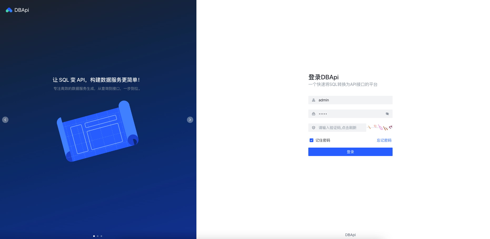

接口列表
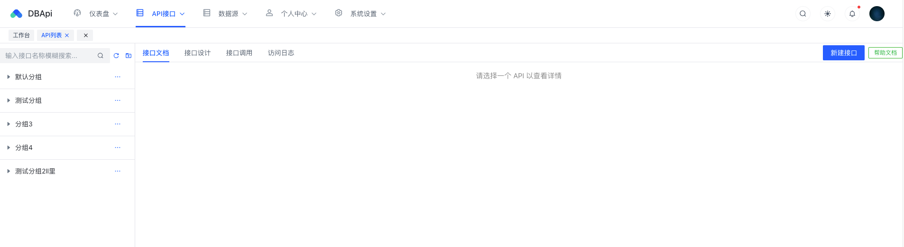

新建接口
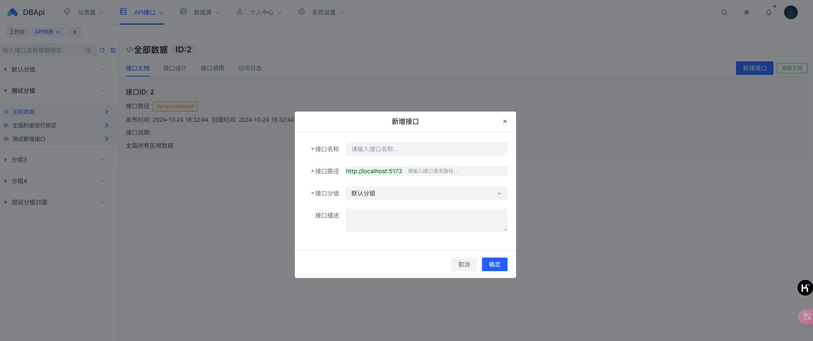

接口设计
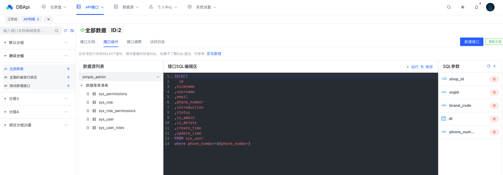

接口文档
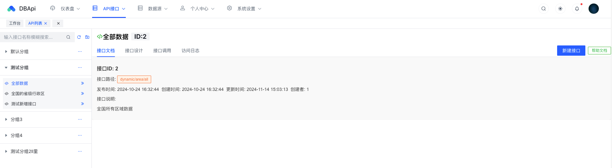

接口调用
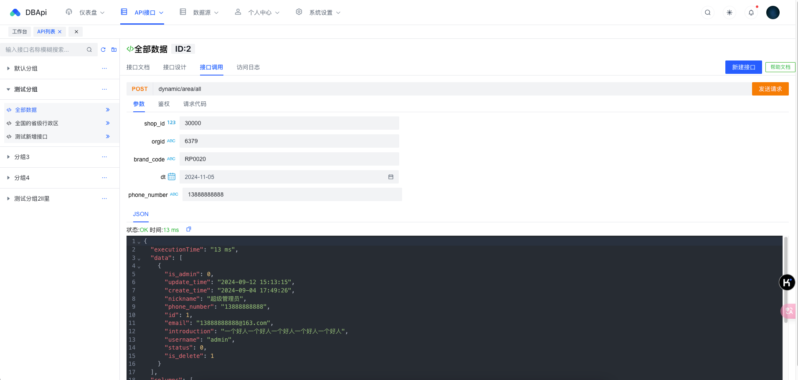

数据源列表
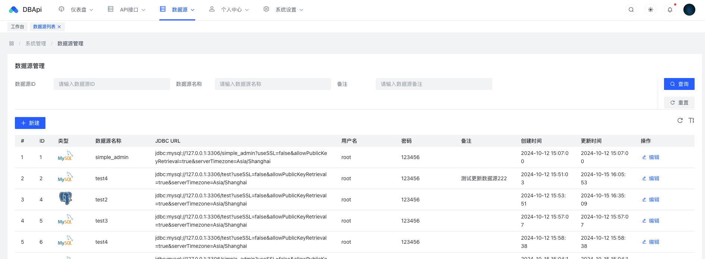

角色列表
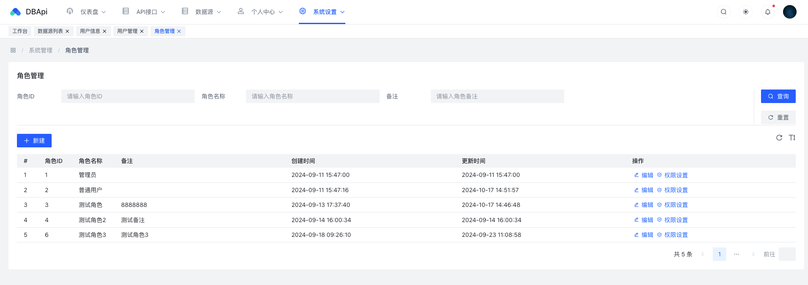

给角色分配权限
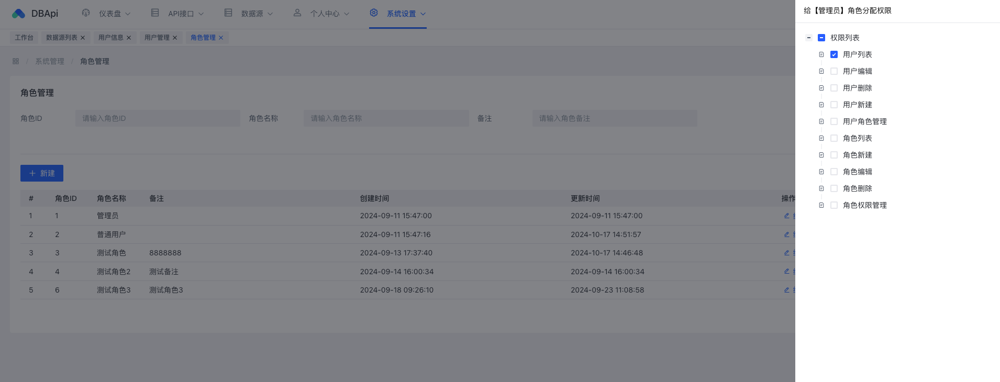

用户中心
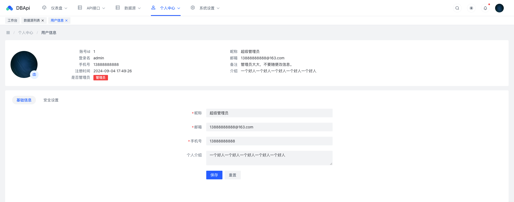

用户列表
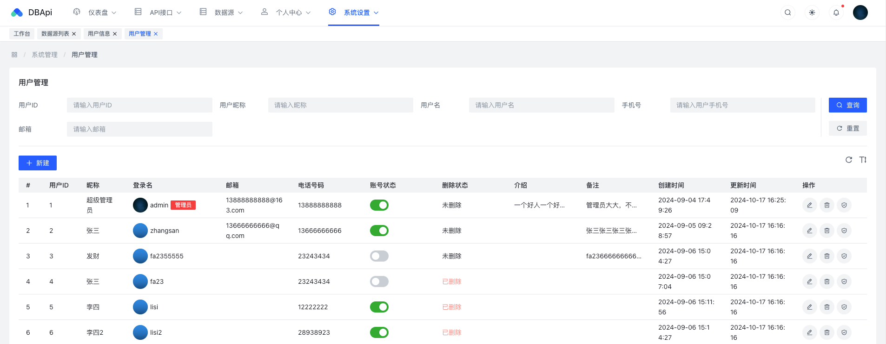


# 🎓 学习交流

- **GitHub 项目主页**  
  [https://github.com/FearlessPeople/DBApi](https://github.com/FearlessPeople/DBApi)  
  欢迎提交 Issue 和 Pull Request，为项目贡献代码或提出建议。

- **常见问题与文档**  
  请访问 [项目 Wiki](https://github.com/FearlessPeople/DBApi/wiki) 查看详细使用文档和常见问题解答。

**欢迎 Star 项目并分享给更多人，一起让 DBApi 更加完善！**

